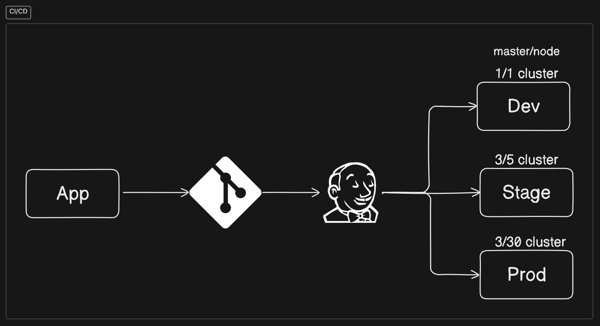

### **CI/CD**

**CI/CD** stands for **Continuous Integration** and **Continuous Deployment/Delivery**. It automates the process of integrating code changes, testing, and deploying applications, ensuring faster and more reliable delivery.

This diagram shows a **CI/CD pipeline** for an application (App) using Jenkins for automation and multiple environments (Dev, Stage, Prod).

### Steps:

1. **App**: The source application code.
2. **Version Control (Git)**: The code is pushed to a version control system like Git.
3. **Jenkins (CI Tool)**: Jenkins automates the pipeline process:
   - Triggers builds and tests upon code commits.
4. **Environments**:
   - **Dev (1/1 cluster)**: A development environment with a small cluster for testing the app during development.
   - **Stage (3/5 cluster)**: Staging environment with a larger cluster for more thorough testing before production.
   - **Prod (3/30 cluster)**: Production environment with the largest cluster for live deployment and handling real traffic.

Each cluster is scaled to suit the needs of each stage, with production having the highest resources to support actual users.

---

### **Continuous Integration (CI)**:

**Purpose**:

- Automate the process of integrating code from multiple developers frequently (daily or more).

**Key Aspects**:

- **Frequent Commits**: Developers merge code changes to the shared repository often.
- **Automated Testing**: Runs unit tests automatically to detect bugs early.
- **Build Automation**: Ensures code compiles and passes tests before integration.

**Benefits**:

- Early bug detection.
- Reduces integration challenges.
- Improves collaboration among teams.

---

### **Continuous Delivery (CD)**:

**Purpose**:

- Ensure that code is always in a deployable state, automating the release process up to production.

**Key Aspects**:

- **Automated Testing**: Beyond unit tests, also includes integration and acceptance tests.
- **Staging Environments**: Automates the deployment to staging environments for further validation.
- **Manual Approval**: Can include a manual step before production deployment.

**Benefits**:

- Ensures fast and reliable releases.
- Reduces the risk of release failures.
- Speeds up feedback loops.

---

### **Continuous Deployment (CD)**:

**Purpose**:

- Automates the entire process, from integration to deployment, pushing every change to production without manual intervention.

**Key Aspects**:

- **Fully Automated Pipeline**: If code passes all tests, it’s deployed directly to production.
- **No Manual Intervention**: Continuous deployment eliminates manual approvals for production release.

**Benefits**:

- Faster delivery of features to end-users.
- Reduces manual errors.
- Encourages small, frequent releases for better stability.

---

### **CI/CD Pipeline Stages**:

1. **Source Stage**:
   Code changes pushed to version control (Git, etc.).
2. **Build Stage**:
   Compiles code and packages the application.
3. **Test Stage**:
   Runs automated tests (unit, integration, etc.).
4. **Deploy Stage**:
   Automatically deploys to staging or production environments.
5. **Monitor Stage**:
   Monitors deployed applications for issues (logs, errors).

---

### **Popular CI/CD Tools**:

- **Jenkins**: Open-source automation server.
- **GitLab CI/CD**: Integrated tool for GitLab repositories.
- **CircleCI**: Cloud-based CI/CD platform.
- **Travis CI**: Continuous integration service for GitHub projects.
- **GitHub Actions**: Built-in CI/CD for GitHub.

---

### **Benefits of CI/CD**:

- **Faster Release Cycles**: Speeds up the process from code integration to deployment.
- **Improved Code Quality**: Automated testing ensures consistent, high-quality code.
- **Reduced Risks**: Small, frequent releases lower the chance of deployment failures.
- **Enhanced Collaboration**: Teams can work and integrate code seamlessly.

---

### **Key Takeaway**:

## CI/CD automates the development lifecycle, ensuring that code changes are tested, integrated, and deployed efficiently, leading to faster, reliable releases with reduced manual effort.

---

### When to Use Jenkins:

1. **Complex Pipelines**:

   - When you need custom CI/CD pipelines with multiple steps (build, test, deploy) across various environments (Dev, Stage, Prod).
   - If your project requires integration with different tools (e.g., Git, Docker, Kubernetes).

2. **Customization and Flexibility**:

   - Jenkins offers a wide range of plugins to support diverse workflows and can be easily customized to meet specific project needs.

3. **Self-Hosted**:

   - If you need full control over your CI/CD infrastructure and prefer hosting the pipeline in your own environment.

4. **Large Teams/Enterprises**:

   - Jenkins is ideal for large-scale projects or teams that need centralized management of multiple CI/CD pipelines.

---

### When **Not** to Use Jenkins:

1. **Small Projects or Startups**:

   - Jenkins can be overkill for small projects where simple CI/CD is enough. Instead, use **GitHub Actions**, **GitLab CI**, or **CircleCI**, which are easier to set up and maintain.

2. **Managed CI/CD Needs**:

   - If you prefer a fully managed service without the hassle of maintaining servers, plugins, and updates, choose cloud-based options like **GitHub Actions** or **AWS CodePipeline**.

3. **Quick Setup**:

   - Jenkins requires more setup and maintenance. For quick deployment pipelines with minimal setup, other simpler CI/CD tools might be better.

In summary, use Jenkins when you need complex, flexible pipelines with full control. For simpler projects or fully managed solutions, choose cloud-based CI/CD tools.
