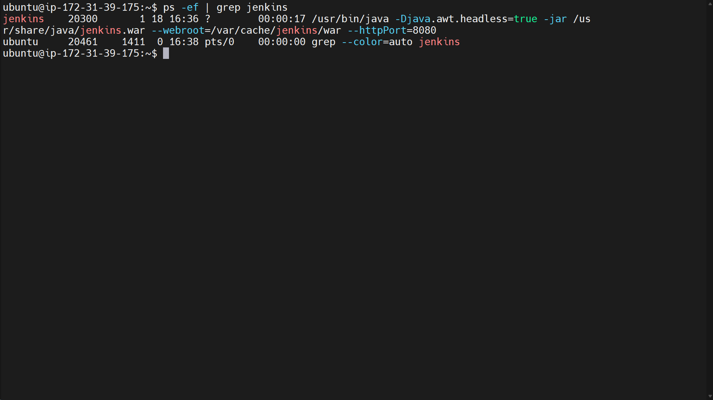

# Jenkins Installation on AWS EC2 (Ubuntu)

### Step 1: Launch an EC2 Instance


1. **Log in** to the AWS Management Console.
2. **Navigate to EC2** and click on **Launch Instance**.
3. **Select an AMI**: Choose **Ubuntu Server 20.04 LTS**.
4. **Choose Instance Type**: Select `t2.micro` (free tier eligible).
5. **Configure Instance**: Default settings are usually fine.
6. **Add Storage**: Default 8 GB is sufficient.
7. **Configure Security Group**:
   - **Inbound Rules**:
     - **SSH**: Port 22 (for SSH access)
     - **HTTP**: Port 80 (for web access)
     - **Custom TCP**: Port 8080 (Jenkins default port)
8. **Launch Instance**: Review and launch; select/create a key pair for SSH access.

### Step 2: Connect to the EC2 Instance

- Open terminal and connect via SSH:
  ```bash
  ssh -i path/to/your-key.pem ubuntu@your-ec2-public-ip
  ```

### Step 3: Update the System

- Update package manager:
  ```bash
  sudo apt update && sudo apt upgrade -y
  ```

### Step 4: Install Java

- Install OpenJDK (required for Jenkins):
  ```bash
  sudo apt install fontconfig openjdk-17-jre -y
  ```
- Verify Java installation:

  ```bash
  java -version
  ```

  

### Step 5: Add Jenkins Repository

1. Add Jenkins key:
   ```bash
   sudo wget -O /usr/share/keyrings/jenkins-keyring.asc \
   https://pkg.jenkins.io/debian-stable/jenkins.io-2023.key
   ```
2. Add Jenkins repository:
   ```bash
   echo "deb [signed-by=/usr/share/keyrings/jenkins-keyring.asc]" \
   https://pkg.jenkins.io/debian-stable binary/ | sudo tee \
   /etc/apt/sources.list.d/jenkins.list > /dev/null
   ```

### Step 6: Install Jenkins

1. Update package manager again:
   ```bash
   sudo apt-get update
   ```
2. Install Jenkins:
   ```bash
   sudo apt-get install jenkins -y
   ```

To verify that Jenkins is running, use:

```bash
ps -ef | grep jenkins
```



### Step 8: Access Jenkins Web Interface

- Open a web browser and go to:

```

http://your-ec2-public-ip:8080

```


- Unlock Jenkins with the initial admin password.

### Step 9: Retrieve Initial Admin Password

- Run the command to get the password:

```bash
sudo cat /var/lib/jenkins/secrets/initialAdminPassword
```

### Step 10: Set Up Jenkins

1. Follow on screen instructions to install suggested plugins.
2. Create an admin user and complete setup.


### Conclusion

You have successfully installed Jenkins on an AWS EC2 instance running Ubuntu. You can now configure jobs and automate your CI/CD processes.
