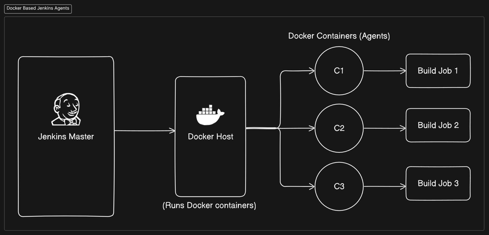

### Jenkins

- **Jenkins** is an open-source automation server used to implement **Continuous Integration (CI)** and **Continuous Delivery (CD)** for software development projects.
- It allows developers to automate the building, testing, and deployment of applications.

### Key Features:

1. **Extensibility**: Jenkins has a rich ecosystem of plugins that extend its capabilities (over 1,500 plugins available).

2. **Easy Installation**: Can be installed on various operating systems and is easy to set up.

3. **Distributed Builds**: Supports distributed builds across multiple machines, which helps speed up the build process.

4. **Integration**: Integrates with various version control systems (e.g., Git, Subversion), build tools (e.g., Maven, Gradle), and testing frameworks.

5. **Pipeline as Code**: Supports defining build pipelines in code using **Jenkinsfile**, allowing versioning and easy modifications.

### Common Use Cases:

- **Automating Builds**: Automatically building projects whenever code is committed.
- **Running Tests**: Executing tests automatically to ensure code quality.
- **Deployment**: Automating the deployment of applications to different environments (Dev, Stage, Prod).

### Jenkins Architecture:

- **Master-Slave Architecture**:
  - **Master**: Controls the entire Jenkins environment and manages jobs.
  - **Slaves (Agents)**: Execute jobs and report back to the master. This setup allows distributed build execution.

### When to Use Jenkins:

- For complex CI/CD workflows requiring customization and flexibility.
- In large teams or enterprises needing centralized CI/CD management.
- When you want full control over the CI/CD infrastructure.

### When Not to Use Jenkins:

- For small projects where simpler CI/CD tools are sufficient.
- If you prefer a fully managed CI/CD service (e.g., GitHub Actions, GitLab CI).
- When quick setup is needed, as Jenkins can be more complex to configure.

### Basic Pipeline Example (Jenkinsfile):

```groovy
pipeline {
    agent any
    stages {
        stage('Build') {
            steps {
                // Commands to build the application
                sh 'mvn clean install'
            }
        }
        stage('Test') {
            steps {
                // Commands to run tests
                sh 'mvn test'
            }
        }
        stage('Deploy') {
            steps {
                // Commands to deploy the application
                sh 'deploy.sh'
            }
        }
    }
}
```

- Jenkins is a powerful tool for automating CI/CD processes, suitable for projects of varying sizes and complexities. With its extensive features and flexibility, it is a popular choice among development teams for improving software delivery efficiency.

---

# Jenkins Master-Worker Architecture

Jenkins uses a **master-worker** architecture to distribute the workload of building, testing, and deploying across multiple machines, providing scalability and high availability. This setup allows Jenkins to efficiently run large-scale CI/CD pipelines.

---

### Components of Jenkins Master-Worker Architecture

#### 1. **Jenkins Master**

- **Central Control Unit**: The Jenkins master is the primary control unit responsible for managing the Jenkins environment.
- **Core Responsibilities**:
  - Scheduling build jobs.
  - Assigning jobs to worker nodes (agents).
  - Monitoring the status of worker nodes.
  - Maintaining the build pipeline configurations.
  - Providing the web UI for users to interact with Jenkins.
  - Reporting the results of the builds/tests to the user.
  - Managing plugins and system configuration.

#### 2. **Jenkins Worker (Agent)**

- **Execution Units**: Worker nodes (also called agents) are machines responsible for executing build jobs dispatched by the Jenkins master.
- **Key Characteristics**:
  - A worker can be any physical machine, virtual machine (VM), or container that Jenkins connects to execute jobs.
  - The worker does not have the Jenkins UI; it only communicates with the master for job execution.
  - Each worker has its own set of tools (e.g., Java, Git, Maven) to run the job.
  - Workers can run on different operating systems (Linux, Windows, etc.) depending on the environment needed for the job.

---

### Jenkins Master-Worker Communication

- **Communication**: The Jenkins master communicates with workers using the Jenkins **remoting** protocol (over SSH or through the Jenkins agent).
- **Job Assignment**: The master sends jobs to workers and waits for feedback on job execution status.
- **Workers Send Results**: After executing the job, workers send the results back to the master for logging, monitoring, and reporting.

---

### Benefits of Jenkins Master-Worker Architecture

1. **Scalability**: As the number of builds and tests increases, more worker nodes can be added to distribute the workload, allowing Jenkins to scale horizontally.
2. **Distributed Build Execution**: Different jobs can be run on different worker nodes, improving resource usage.
3. **Platform Flexibility**: Workers can run different platforms (Windows, Linux, macOS), allowing Jenkins to build and test across different environments.
4. **Fault Tolerance**: If a worker node fails, other nodes can take over, ensuring continuous delivery.

---

### Example Use Case

- **Master-Only Setup**: In a small environment, Jenkins master may handle both orchestration and job execution.
- **Master-Worker Setup**: In larger environments with complex pipelines, the master handles scheduling and configuration, while multiple workers handle parallel job execution. For instance, one worker might run tests on Linux, another on Windows, ensuring multi-platform support.

---

### Setting Up a Jenkins Worker Node

#### Step 1: Prepare the Worker Node

- Install Java (same version as Jenkins) on the worker node.
- Ensure the worker node can communicate with the master (via SSH or agent protocol).

#### Step 2: Configure the Worker in Jenkins

1. **Go to Jenkins Dashboard** → **Manage Jenkins** → **Manage Nodes and Clouds**.
2. **Create New Node** → Set node properties like name, remote root directory, and number of executors.
3. **Launch agent** via SSH or manually using the Jenkins agent.

---

### When to Use the Master-Worker Setup

- **Parallel Job Execution**: To run multiple jobs in parallel across different environments.
- **Load Balancing**: Distribute the workload across multiple workers to avoid overloading the master.
- **Isolation**: Run specific jobs in isolated environments (e.g., test in a containerized environment).

---

### Diagram of Jenkins Master-Worker Architecture

```
  +------------------------------------------------+
  |               Jenkins Master                   |
  |------------------------------------------------|
  |  - Schedules builds                            |
  |  - Assigns jobs to worker nodes                |
  |  - Manages build results                       |
  |  - Hosts the web UI for users                  |
  +-------------------------+---------------------+
                            |
  +-------------------------+---------------------+
                            |
       +--------------------v---------------------+
       |                  Worker Node 1           |
       |------------------------------------------|
       |  - Receives and runs build jobs          |
       |  - Sends results to master               |
       +--------------------+---------------------+
                            |
  +-------------------------v---------------------+
       |                  Worker Node 2           |
       |------------------------------------------|
       |  - Receives and runs build jobs          |
       |  - Sends results to master               |
       +------------------------------------------+
```

---

By using the **master-worker** setup, Jenkins can efficiently manage multiple build environments and run complex CI/CD pipelines in a distributed, scalable, and isolated manner.

### Jenkins with Docker Agents: Latest Approach



**Overview**:

- Using Docker agents with Jenkins is a modern and flexible way to scale and isolate builds in a CI/CD pipeline.
- Instead of setting up permanent, dedicated worker nodes (VMs or physical machines), Jenkins dynamically launches and destroys Docker containers as agents for build jobs.
- This approach provides resource efficiency, better isolation, and consistency across builds, as each build starts with a clean environment.

### Key Components:

1. **Jenkins Master**:

   - Orchestrates the build jobs, assigns them to Docker containers as agents, and manages the overall pipeline.

2. **Docker Agent**:
   - A lightweight container that runs a single job and is destroyed afterward.
   - Offers a clean, consistent, and isolated environment for each job.

### How It Works:

1. **Job Submission**: When a job is submitted to Jenkins, instead of assigning it to a dedicated agent or worker node, Jenkins pulls a Docker image and spins up a new container for that job.

2. **Docker Image**: The Docker image can be pre-configured with all the necessary build tools, dependencies, or libraries. Jenkins pulls the image either from Docker Hub or a custom registry.

3. **Job Execution**: The job runs inside the Docker container, isolated from other jobs and environments. Any dependencies or artifacts specific to the job stay inside the container.

4. **Container Destruction**: Once the job is finished, the container is destroyed, freeing up resources and ensuring no leftover artifacts or state affects future builds.

### Benefits of Using Docker Agents in Jenkins:

1. **Isolation**: Each build runs in its own container, ensuring no shared state or conflicts between builds.
2. **Scalability**: Docker agents can be scaled easily across multiple environments, ensuring Jenkins can handle large workloads.

3. **Reproducibility**: Docker ensures that the environment in which the build runs is identical every time, reducing the risk of "works on my machine" issues.

4. **Efficiency**: Containers are lightweight and ephemeral, meaning resources are only consumed when needed, and they are released immediately after use.

5. **Flexibility**: Jenkins can use different Docker images for different types of jobs, allowing for highly customizable environments per job type (e.g., Node.js build, Java build, Python build).

### Jenkins Pipeline with Docker Agent Example:

In a Jenkins pipeline, Docker agents can be defined as follows:

```groovy
pipeline {
    agent {
        docker {
            image 'node:14-alpine'
            label 'my-docker-agent'
            args '-v /var/jenkins_home:/home/jenkins'
        }
    }
    stages {
        stage('Build') {
            steps {
                sh 'npm install'
                sh 'npm run build'
            }
        }
        stage('Test') {
            steps {
                sh 'npm test'
            }
        }
    }
}
```

**Explanation**:

- **agent**: Defines that the build should be run inside a Docker container.
- **image 'node:14-alpine'**: Specifies the Docker image (`node:14-alpine`) that Jenkins will pull and use to run this pipeline.
- **args**: Additional arguments, such as volume mounts, can be passed to the Docker run command.

### Setup Jenkins with Docker Agent:

1. **Install Docker**: Ensure Docker is installed on the Jenkins master.
2. **Install the Docker Plugin**: In Jenkins, go to "Manage Jenkins" > "Manage Plugins" and install the "Docker Pipeline" plugin.
3. **Configure Docker Cloud**:
   - Go to "Manage Jenkins" > "Configure System" > "Cloud" and add a new "Docker" cloud.
   - Specify Docker host details (e.g., `tcp://localhost:2375` if Docker is running locally).
4. **Add Docker Agent Templates**:
   - Define Docker templates for your Jenkins jobs, specifying which Docker image to use for agents, resource limits, and environment variables.

### When to Use Jenkins with Docker Agents:

- When you need **dynamic scaling** of build agents.
- When you need to **isolate builds** to avoid conflicts.
- For **CI pipelines** where each job requires a specific, reproducible environment.
- When managing **cloud-native applications** and microservices development pipelines.

### When Not to Use:

- If your builds need heavy, persistent state or data between jobs.
- When the overhead of setting up Docker is not worth it for small projects with low build frequencies.

---

The **Jenkins Master-Docker Agent approach** differs from the traditional **Master-Worker Nodes approach** in several key aspects. Here's a comparison along with the benefits of using Docker agents over the standard worker nodes.

### **Jenkins Master-Worker Nodes (Traditional Approach)**

1. **Fixed Worker Nodes**:

   - **Structure**: The master is connected to dedicated, pre-configured worker nodes (physical or virtual machines).
   - **Scaling**: The number of worker nodes is fixed, requiring manual intervention to scale by adding more machines.
   - **Environment Consistency**: Each worker node may have a unique environment, potentially causing inconsistency between builds unless carefully managed.

2. **Performance**:

   - Requires a dedicated infrastructure (e.g., EC2 instances or on-prem servers) that stays running, even when idle.
   - Node resource utilization can be inefficient if nodes are under-utilized for small or occasional tasks.

3. **Configuration**:

   - Workers must be pre-configured and maintained individually.
   - Managing software dependencies, security patches, and environment configuration across multiple worker nodes adds complexity.

4. **Cost**:
   - May incur higher costs as worker nodes are always running, even during idle periods.
   - Requires larger upfront infrastructure setup.

---

### **Jenkins Master-Docker Agent Approach (Modern Approach)**

1. **Dynamic, Ephemeral Agents**:

   - **Structure**: The master dynamically spins up Docker containers as needed for different stages of the CI/CD pipeline, acting as temporary agents.
   - **Scaling**: Docker-based agents can be created and destroyed on-demand, allowing for easy horizontal scaling without manual intervention.
   - **Environment Consistency**: Each build runs in its own Docker container, ensuring a consistent and isolated environment for every build.

2. **Performance & Efficiency**:

   - Containers are lightweight and fast to spin up compared to full-fledged worker nodes.
   - Maximizes resource utilization by spinning up only the necessary resources for each build and destroying them afterward.

3. **Configuration**:

   - Each Docker container can be customized for specific needs, providing clean, repeatable, and version-controlled build environments (via Docker images).
   - Simplifies environment management. Instead of managing multiple worker nodes, you manage a Docker image repository with predefined environments.

4. **Cost**:
   - Cost-effective since containers only run for the duration of the build process. No resources are used when there are no builds running.
   - Lower infrastructure cost as it reduces the need for always-on worker nodes.

---

### **Key Benefits of Docker-Based Jenkins Agents**:

- **Elasticity & Scalability**: Docker containers can be scaled up or down easily, depending on the workload.
- **Isolation**: Each build runs in an isolated Docker container, preventing issues caused by dependency conflicts or environmental differences between builds.
- **Consistency**: Docker ensures that every build has the same environment, avoiding the "works on my machine" problem.
- **Resource Efficiency**: Containers only run during the build process, which means resources are freed when builds are not running, leading to optimized infrastructure usage.
- **Portability**: Docker containers can run on any system that supports Docker, making it easy to move workloads across environments (e.g., local, cloud).

### Summary:

- **Master-Worker Nodes** approach is more suitable for static, long-running build agents, which can be costly and require dedicated maintenance.
- **Master-Docker Agents** is a more modern, flexible, and cost-efficient approach that takes advantage of containerization to deliver scalable, consistent, and isolated build environments on-demand.

---

### **Architecture Diagram Explanation**:

1. **Jenkins Master**:

   - Central controller that orchestrates CI/CD pipelines.
   - It doesn't perform any build tasks but delegates these tasks to dynamically created Docker-based agents.

2. **Docker Agents (C1, C2, C3)**:

   - These are ephemeral, temporary containers that Jenkins Master launches when needed for specific stages or jobs in the CI/CD pipeline.
   - Each container is a clean, isolated environment with the required tools and dependencies needed to run the build.

3. **Docker Host**:

   - A server or cluster that runs Docker. Jenkins Master communicates with the Docker host to spin up containers.
   - Containers are started, perform the build job, and are then destroyed to free up resources.

4. **Source Control (Git)**:
   - The application's source code is stored in a Git repository.
   - The Jenkins Master pulls code from this repository as part of the CI pipeline to test, build, and deploy.

### **Steps**:

1. Jenkins Master fetches the latest code from the Git repository (or any source control system).
2. Based on the Jenkins pipeline, Jenkins Master triggers the creation of Docker containers (agents).
3. These Docker agents execute the build, test, and deployment stages, using the isolated environment created for each task.
4. Once the job is complete, the Docker agents are terminated, ensuring no leftover state or resources are occupied.
5. The final build artifact or test results are sent back to Jenkins Master for reporting or further processing.

---

### **Sample Architecture Diagram:**

```plaintext
                +-------------------------+
                |     Jenkins Master       |
                |                         |
                +-------------------------+
                          |
                          v
            +-------------------------------+
            |     Docker Host                |
            |     (Runs Docker containers)   |
            +-------------------------------+
                |            |           |
                v            v           v
            +------+      +------+     +------+
            |  C1  |      |  C2  |     |  C3  |   <-- Docker Containers (Agents)
            +------+      +------+     +------+
               |             |            |
        +---------------+  +--------------+  +--------------+
        |  Build Job 1   |  |  Build Job 2  |  |  Build Job 3  |
        +---------------+  +--------------+  +--------------+
```

This diagram represents:

- **Jenkins Master** handling orchestration and delegating build tasks.
- **Docker containers (C1, C2, C3)** are the ephemeral agents performing isolated build tasks.
- Each container executes a specific build or test job, and once complete, it is terminated.

### **Docker-Based Jenkins Benefits**:

- **Scalability**: More containers can be spun up based on demand.
- **Efficiency**: Containers are lightweight and use fewer resources than traditional VMs.
- **Environment Consistency**: Each job runs in a fresh container, ensuring clean environments every time.
